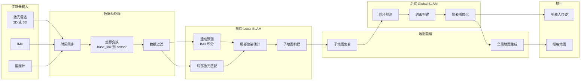

# Cartographer 深度解析：实时 SLAM 的工业级选择

## 一、Cartographer 是什么

**Cartographer** 是 Google 开源的 **实时 SLAM 框架**，支持 **2D / 3D**，核心目标是：

> **在构建地图的同时，持续进行全局一致性优化。**

与 GMapping 不同，Cartographer 从一开始就将 **回环检测与全局优化** 作为核心能力，而不是附加能力。

---

## 二、核心思想

> **先把局部地图拼对，再用全局优化把“走过的路”整体拉正。**

---

## 三、核心算法结构

Cartographer 由三条关键链路组成：

### 1️⃣ Local SLAM（前端）

* 输入：

    * 2D 激光雷达
    * IMU（可选但强烈建议）
    * 里程计（可选）

* 职责：

    * 高频位姿估计
    * 激光 scan matching
    * 生成 **局部子地图（Submap）**

特点：

* 实时性强
* 对 IMU 依赖明显（尤其是 2D 模式）

---

### 2️⃣ Submap（子地图机制）

* 每若干帧激光构成一个 Submap
* Submap 内部局部一致
* Submap 之间尚未全局约束

➡️ 这是 Cartographer 能扩展到大环境的关键设计。

---

### 3️⃣ Global SLAM（后端）

* 回环检测（Loop Closure）
* 位姿图构建
* 非线性优化（Sparse Pose Graph）

输出：

* 全局一致地图
* 位姿整体修正

---

## 四、为什么 Cartographer 精度高

| 能力     | 说明        |
|--------|-----------|
| 回环检测   | 主动搜索历史匹配  |
| 全局优化   | 位姿图整体求解   |
| IMU 融合 | 姿态与运动约束更强 |
| Submap | 减少局部误差扩散  |

➡️ **不靠“里程计勉强撑住”，而是靠数学模型纠偏**

---

## 五、Cartographer 的优势

* 地图全局一致性强
* 支持大面积室内环境
* 对轮滑、累计误差更鲁棒
* 2D / 3D 统一架构
* 工业级算法设计思路

---

## 六、Cartographer 的工程代价（非常重要）

### 1️⃣ 算力要求高

* 后端优化占用 CPU 明显
* ARM 平台需谨慎评估
* 清洁机器人低端主控可能吃紧

---

### 2️⃣ 对 IMU 质量敏感

* IMU 噪声大 → 地图抖动
* 时间同步不准 → 建图直接失败

➡️ **IMU 不是“可选项”，而是“成败项”**

---

### 3️⃣ 参数复杂、调试成本高

* 参数数量多
* 不同环境差异明显
* 初期调参周期长

---

### 4️⃣ ROS2 支持现状

* ROS1 版本成熟
* ROS2 版本可用，但维护活跃度一般
* 工程集成成本高于 SLAM Toolbox

---

## 七、与 GMapping 的关键差异（直观对比）

| 维度     | GMapping | Cartographer |
|--------|----------|--------------|
| 算法思想   | 粒子滤波     | 图优化          |
| 回环能力   | 弱        | 强            |
| 依赖里程计  | 高        | 中            |
| IMU 需求 | 低        | 高            |
| 算力需求   | 低        | 高            |
| 地图一致性  | 中        | 高            |

---

## 八、在室内清洁机器人中的真实定位

### 适合使用 Cartographer 的情况

* 中大型室内环境（商场、写字楼）
* 对地图一致性要求高
* IMU 质量可靠
* 主控算力充足
* 建图频率不高（非频繁重建）

---

### 不太适合的情况

* 低端 MCU + 低功耗 SoC
* IMU 质量一般
* 追求“即插即用”
* 地图规模小、重复运行场景

---

## 九、工程选型结论（清洁机器人视角）

* **GMapping**：
  稳、轻、老牌，适合入门与低算力平台

* **Cartographer**：
  精度高、体系完整，但“吃资源、吃工程能力”

* **SLAM Toolbox（ROS2）**：
  往往是二者之间的折中解

> **Cartographer 更像“研究与工业算法”，而不是“轻量级产品方案”。**

---

## 十、一句话总结

> **Cartographer 用算力换一致性，用工程复杂度换地图质量。**

## 🧠 Cartographer 软件架构图（Mermaid）

> **前端负责“局部稳定”，后端负责“全局一致”**

这和 GMapping 最大区别就是：

| 模块 | GMapping | Cartographer  |
|----|----------|---------------|
| 前端 | 粒子滤波     | Scan Matching |
| 后端 | 无        | Pose Graph    |
| 回环 | 隐式       | 显式            |
| 地图 | 单张       | 子地图拼接         |

#### 🔹 前端 Local SLAM

* 高频运行
* 实时性强
* 不做全局修正
* 保证“当前不飘”

#### 🔹 后端 Global SLAM

* 低频运行
* 回环检测
* 图优化
* 统一全局坐标

## 🧨 Cartographer 工程坑位（真实经验）

* IMU 标定不好 = 整个系统崩
* 回环参数过激 = 地图撕裂
* 子地图尺寸不合理 = CPU 爆
* 室内动态物体 = 回环误判

> **对室内清洁机器人而言，Cartographer 的二次开发成本，主要集中在：
> 传感器适配、时间系统、性能裁剪、工程稳定性，而不是 SLAM 数学本身。**

---

### 1️⃣ 传感器接入与数据模型适配（50% 的二次开发成本）

#### 需要处理的点

* 激光雷达数据格式
* 时间戳来源（硬件 / 软件）
* 点云密度与扫描频率
* IMU 数据坐标系与方向约定

#### 常见改动

* 自定义 `SensorBridge`
* 调整 `TrajectoryBuilder`
* 适配非标准 2D 雷达（非等角度、非完整 360°）

---

### 2️⃣ 时间系统与多传感器同步（成败项）

Cartographer **对时间极其敏感**。

#### 必须关注

* 激光 / IMU / 里程计是否同一时间基准
* 是否存在 MCU → 上位机时间漂移
* ROS2 + DDS 时间戳传递延迟

#### 二次开发内容

* 统一时间源（硬件时间 or ROS Time）
* 延迟补偿逻辑
* 丢帧 / 延时数据的处理策略

---

### 3️⃣ IMU 使用策略调整

#### 原生设计假设

* IMU 质量较好
* 安装姿态准确
* 噪声模型可信

#### 实际情况

* IMU 噪声偏大
* 振动明显
* 安装角度存在偏差

#### 二次开发常见方向

* 弱化 IMU 权重
* 修改运动模型
* 在 2D 模式下降低对 IMU 的依赖

---

### 4️⃣ 性能裁剪与算力控制

#### 常见裁剪点

* Submap 尺寸与数量
* 回环搜索频率
* 后端优化频率
* 点云下采样策略

目标只有一个：

> **让 SLAM 不抢导航和控制的 CPU**

---

### 5️⃣ 地图生命周期管理

原生 Cartographer 偏“研究工具”，而不是“产品组件”。

#### 二次开发通常包括

* 地图保存 / 加载流程
* 建图 → 定位的切换机制
* 多次建图的融合策略
* 地图版本管理

---

### 6️⃣ 与导航系统的接口重构

Cartographer 输出的是：

* 连续位姿
* 动态优化后的坐标系

而导航系统需要：

* 稳定 TF
* 连续、不跳变的位姿

#### 常见处理

* TF 平滑
* 位姿锁定策略
* 回环时的导航抖动抑制

---

### 7️⃣ 动态环境适配

* 行人
* 宠物
* 移动家具

可能涉及：

* 激光点过滤
* 动态物体剔除
* Submap 更新策略调整

---

### 8️⃣ 多轨迹 / 多地图支持

* 多楼层
* 多区域
* 多机器人共用地图

涉及 Cartographer 内部：

* Trajectory 管理
* Pose Graph 复用