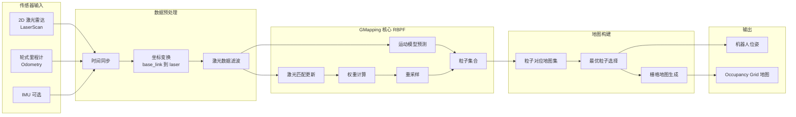

# GMapping（RBPF-SLAM）在室内清洁机器人中的应用解析

## 一、GMapping 是什么

**GMapping** 是一种基于 **RBPF（Rao-Blackwellized Particle Filter）** 的 **2D 激光 SLAM 算法**，用于在未知环境中**同时完成建图与定位
**。

核心输入：

* 2D 激光雷达（LaserScan）
* 轮式里程计（Odometry）

核心输出：

* 2D 栅格地图（Occupancy Grid）
* 机器人位姿估计

---

## 二、核心思想

> **用粒子滤波表示多种可能的机器人轨迹，每条轨迹独立生成一张地图，从中筛选最可信的一条。**

---

## 三、算法原理

### 1️⃣ 粒子滤波（Particle Filter）

* 每个粒子 = 一种可能的机器人位姿轨迹
* 粒子携带：

    * 当前位姿
    * 对应的地图估计

---

### 2️⃣ Rao-Blackwellized 优化

* 位姿 → 用粒子采样
* 地图 → 条件概率解析计算

➡️ 大幅降低计算复杂度，使其能在普通 CPU 上实时运行。

---

### 3️⃣ 工作流程

```
里程计预测
   ↓
激光扫描匹配
   ↓
粒子权重更新
   ↓
重采样
   ↓
地图更新
```

---

## 四、为什么 GMapping 适合室内清洁机器人

### 优势高度匹配场景

| 维度  | 表现         |
|-----|------------|
| 环境  | 室内、结构化     |
| 传感器 | 2D 激光雷达    |
| 算力  | 中低端 CPU 可跑 |
| 地图  | 静态环境为主     |

➡️ **与清洁机器人“平面、低速、重复运行”的特性高度契合**

---

## 五、GMapping 的优点

* 算法成熟、稳定
* 对 2D 雷达依赖明确
* 对 IMU 要求不高
* ROS 生态最完善之一
* 调参经验丰富，风险可控

---

## 六、GMapping 的局限性

### 1️⃣ 对里程计依赖较强

* 轮滑、打滑会导致地图漂移
* MCU 侧里程计质量至关重要

---

### 2️⃣ 闭环能力有限

* 回环检测能力弱
* 大面积环境容易出现累积误差

---

### 3️⃣ 动态环境适应性差

* 对行人、宠物敏感
* 地图“拉丝”“重影”常见

---

### 4️⃣ ROS2 支持现状

* 原生 GMapping 为 ROS1 包
* ROS2 通常通过：

    * 移植版
    * 或被 **SLAM Toolbox / Cartographer** 替代

---

## 七、在 ROS 架构中的位置

```
2D 激光雷达
      ↓
   GMapping
      ↓
Occupancy Grid Map
      ↓
Navigation / Path Planning
```

---

## 八、参数调校的关键方向（不列具体参数）

* 粒子数量（精度 vs 性能）
* 激光匹配权重
* 地图更新频率
* 运动模型可信度
* 里程计噪声模型

➡️ **调参质量直接决定地图质量**

## 🧠 GMapping（RBPF-SLAM）软件架构图（Mermaid）



---

**完整一帧流程：**

1. 激光 + 里程计时间同步
2. 运动模型预测粒子新位姿
3. 激光 Scan Matching 修正粒子
4. 计算每个粒子的权重
5. 低权重粒子被淘汰（重采样）
6. 用最优粒子生成当前地图