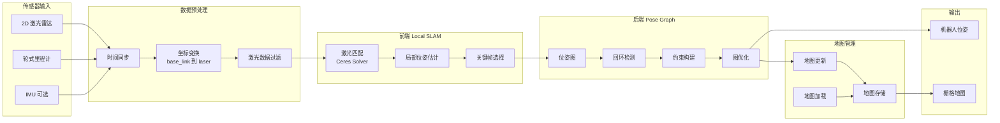

# SLAM Toolbox 二次开发指南

## 一、SLAM Toolbox 是什么

**SLAM Toolbox** 是由 **Steve Macenski（Nav2 维护者）** 主导开发的 **2D 激光 SLAM 框架**，本质上是：

> **对 GMapping 的现代化重构 + 图优化增强 + ROS2 原生支持**

目标非常明确：
**在 ROS2 中，替代 GMapping，成为默认 2D SLAM。**

---

## 二、核心思想

> **用现代图优化方法做 2D SLAM，并把“工程可用性”放在算法之前。**

---

## 三、核心架构（工程视角）

### 1️⃣ 前端（Scan Matching）

* 2D 激光雷达
* 高效扫描匹配（非粒子滤波）
* 实时位姿估计

特点：

* 算力占用低于 Cartographer
* 稳定性高于 GMapping

---

### 2️⃣ 后端（Pose Graph）

* 位姿图维护
* 回环检测
* 全局优化（非线性优化）

➡️ **具备真正的全局一致性能力**

---

### 3️⃣ 地图表示

* Occupancy Grid（2D 栅格）
* 支持 **地图持续优化**
* 支持地图序列化 / 反序列化

---

## 四、SLAM Toolbox 的关键能力

### ✅ ROS2 原生

* rclcpp
* Lifecycle Node
* QoS 适配良好
* 与 Nav2 无缝衔接

---

### ✅ 多模式支持

| 模式           | 说明     | 场景     |
|--------------|--------|--------|
| Mapping      | 在线建图   | 首次建图   |
| Localization | 已有地图定位 | 量产运行   |
| Lifelong     | 地图持续更新 | 环境缓慢变化 |

---

### ✅ 地图管理能力

* 保存 / 加载地图
* 子图合并
* 多次建图融合
* 回环后自动修正

---

## 六、SLAM Toolbox 在清洁机器人中的实际价值

### 1️⃣ 建图阶段

* 首次部署或重新建图
* 操作人员推着或遥控机器人
* 地图质量稳定、不易拉丝

---

### 2️⃣ 量产运行阶段

* 切换到 Localization 模式
* 不再修改地图
* 定位稳定，CPU 占用低

---

### 3️⃣ 长期运行（Lifelong）

* 家具缓慢变化
* 允许小范围地图更新
* 避免频繁重建地图

---

## 七、对传感器的真实要求

| 传感器     | 要求      |
|---------|---------|
| 2D 激光雷达 | 必须      |
| 里程计     | 强烈建议    |
| IMU     | 可选（非必须） |

➡️ **相比 Cartographer，对 IMU 依赖明显更低**

---

## 八、常见工程问题

* 里程计质量直接影响定位稳定性
* 激光时间戳必须准确
* 地图分辨率不要过高（CPU）
* Lifelong 模式需谨慎开启

## 🧠 SLAM Toolbox 软件架构图（Mermaid）

---

> **SLAM Toolbox = 2D 激光 SLAM + Pose Graph + 地图生命周期管理**

## 二次开发方向

### 1️⃣ 传感器接入与数据适配

* **激光雷达**

    * 扫描频率、点云密度
    * ROS2 接口（`sensor_msgs/LaserScan`）
    * 非标准雷达格式需自定义 `LaserScan` 转换节点
* **里程计 / MCU**

    * 确保 Odometry 数据稳定
    * 里程计噪声模型可在参数中调整
* **IMU（可选）**

    * 用于姿态约束，低成本机器人可弱化依赖
* **时间同步**

    * 保证 LaserScan / Odometry / IMU 时间戳一致
    * 必要时加入延迟补偿逻辑

---

### 2️⃣ 参数优化与性能调优

* **Submap 管理**

    * 子图大小、数量
    * 扫描匹配窗口
* **回环检测**

    * 回环频率、搜索范围
    * 对低速、重复路径可调低
* **建图精度**

    * 栅格分辨率
    * 点云下采样策略
* **算力控制**

    * 控制 CPU 占用，确保导航与控制优先级

---

### 3️⃣ 地图生命周期管理（产品化重点）

* 地图保存、加载、切换机制
* 多次建图融合与版本管理
* 运行模式切换：

    * **Mapping**：建图模式
    * **Localization**：定位模式
    * **Lifelong**：长期更新模式

---

### 4️⃣ 与导航系统的衔接

* TF 坐标系管理
* 位姿平滑策略
* 回环或地图优化时的导航抖动处理
* 与 Nav2 / path planner 数据接口对齐

---

### 5️⃣ 工程稳定性增强

* 异常扫描剔除（防止激光反射 / 空洞干扰）
* 数据丢帧容错
* 日志与可视化工具集成
* 参数动态调整能力（运行中可调）

---

### 6️⃣ 可选的高级功能

* 动态障碍物剔除（行人、家具）
* 多机器人共享地图
* 多楼层 / 多区域支持
* 自动地图优化策略（自动选择最优子图或全局地图）

---

## 工程实践

1. **传感器适配 + 数据预处理** → 确保扫描和里程计可靠
2. **参数调优 + 性能控制** → 建图稳定、CPU 可控
3. **地图生命周期管理 + 模式切换** → 支持量产运行
4. **导航接口对接** → 与 Nav2 或自研路径规划融合
5. **稳定性增强 + 异常处理** → 工程可靠性
6. **高级功能开发** → 动态障碍物 / 多机器人 / 多楼层（可选）

### **一、ROS2 接口与传感器适配**

| 模块             | 说明                   | 二次开发/注意点                                       |
|----------------|----------------------|------------------------------------------------|
| 激光雷达 (`/scan`) | 主传感器，LaserScan 消息    | 确保消息频率、时间戳准确；非标准雷达需自定义转换节点；注意旋转方向与坐标系一致        |
| 里程计 (`/odom`)  | RobotOdometry，用于运动模型 | 消息稳定性优先；发布频率≥10Hz；可通过参数调整噪声模型                  |
| IMU (`/imu`)   | 可选                   | 用于姿态约束；低质量 IMU 可降低权重或忽略                        |
| 时间同步           | 所有传感器统一时间基准          | ROS2 Time / DDS QoS 设置；必要时加延迟补偿逻辑              |
| TF 系统          | 坐标系发布                | 确保 `base_link` / `odom` / `map` 正确；回环优化时防止位姿跳变 |

---

### **二、核心参数对照与建议**

| 参数类别              | 典型参数                              | 作用 / 建议值   | 调整目的                     |
|-------------------|-----------------------------------|------------|--------------------------|
| **建图精度**          | `resolution`                      | 0.05~0.1 m | 栅格分辨率，影响地图精度与 CPU 负载     |
| **Submap 管理**     | `submap_size`                     | 35~50 帧    | 子图帧数，影响局部地图质量和回环匹配效率     |
|                   | `submap_publish_period_sec`       | 0.3~0.5 s  | 子图更新频率，平衡实时性和负载          |
| **Scan Matching** | `scan_matcher_translation_weight` | 1~10       | 平衡里程计 vs 激光匹配权重          |
|                   | `scan_matcher_rotation_weight`    | 1~10       | 同上，旋转精度控制                |
| **回环检测**          | `loop_closure_enabled`            | true       | 开启全局优化                   |
|                   | `max_submaps_to_search`           | 5~10       | 回环搜索范围；环境小可调小，减轻 CPU     |
| **性能优化**          | `use_imu_data`                    | true/false | 是否使用 IMU，低质量 IMU 可 false |
|                   | `num_range_data`                  | 1~5        | 每次优化使用多少帧扫描，控制 CPU       |
| **Lifelong 模式**   | `map_update_interval_sec`         | 5~10 s     | 地图自动更新周期，适用于动态环境         |

---

### **三、二次开发重点**

#### 1️⃣ 数据接口处理

* 确保 `/scan`, `/odom`, `/imu` 三者时间戳同步
* 对非标准激光雷达或高频 MCU，需要自定义桥接节点
* TF 坐标系统一：`base_link` → `odom` → `map`

#### 2️⃣ 算法参数调优

* 调整 Submap 帧数和分辨率，兼顾 CPU 和精度
* Scan matching 权重平衡：低速/轮滑环境可适当降低里程计权重
* 回环检测参数：小型室内环境可调低 `max_submaps_to_search`，减少冗余计算

#### 3️⃣ 地图管理

* 地图保存/加载：支持多个楼层或版本
* Mapping → Localization 切换：量产环境只定位，降低算力
* Lifelong 模式：动态更新家具、障碍物

#### 4️⃣ 工程稳定性增强

* 异常扫描剔除：防止反射或缺点破坏地图
* 数据丢帧容错：加入缓冲和重试机制
* 位姿平滑：回环优化时避免导航抖动

#### 5️⃣ 与 Nav2 集成

* 将 SLAM Toolbox 输出的 `map` 与 `pose` 接入 Nav2 `local_costmap` / `global_costmap`
* TF 确保导航里程计与激光位姿一致
* 调整 `pose_topic` QoS，保证导航稳定
