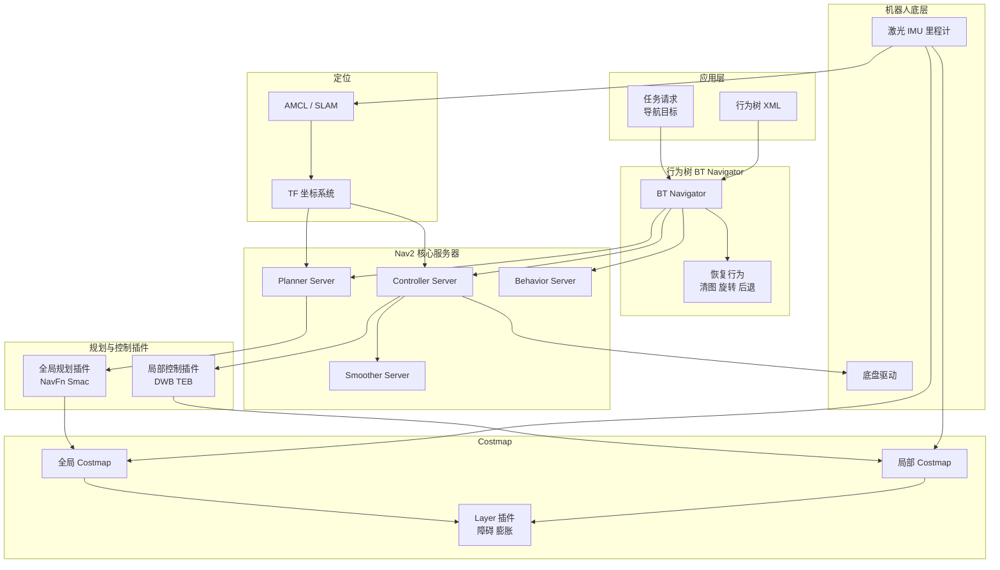

# 🔷 Nav2 是什么？

Nav2（Navigation2）是 ROS2 上的导航框架，相当于 ROS1 的 move_base 的升级版。

它的目标是：

> **给移动机器人提供路径规划、避障、跟踪控制、恢复动作、任务调度的完整导航系统。**

如果把一个机器人导航过程拆开，Nav2 包含：

```
SLAM / 定位
         ↓
Nav2
    ├── 行为树（任务流程管理）
    ├── 全局规划器
    ├── 局部规划器（避障）
    ├── 控制器（轨迹跟踪）
    ├── 恢复行为
    └── 生命周期管理
底盘
```

---

# 🔷 Nav2 的核心组成（工程视角）

## 1) 行为树（Behavior Tree）

Nav2 用 BT（行为树）管理整个导航流程，比如：

* 计算路径
* 往前走
* 遇到障碍就恢复
* 往新路径继续走
* 到终点停止

行为树极其重要，因为：

> 商用机器人通常要跑路很多“导航流程”逻辑，而 BT 视觉化、可配置、可插拔，方便调试。

---

## 2) 全局规划器（Global Planner）

常见插件：

* **NavFn**（Dijkstra）
* **Smac Planner**（Hybrid-A*, 2D/2.5D/3D）
* **A***（栅格搜索）

它负责从**起点 → 终点**找一条**全局可行路径**，但不考虑动态避障。

### 特点

* 生成比较平滑的长路径
* 避开已知地图上的静止障碍物
* 不考虑速度、加速度等动力学限制

---

## 3) 局部规划器（Local Planner / Controller）

nav2 的这个模块实际是控制器，常见的插件是：

* **DWB (Dynamic Window Based controller)** → 类似 DWA（局部规划+控制）
* **TEB (Timed Elastic Band)** → 优化轨迹的避障算法
* **Regulated Pure Pursuit** → 简易纯跟踪控制器带速度调节
* **MPC 控制器（第三方插件）** → 使用 Model Predictive Control

局部规划器负责：

> **在局部范围内计算即时速度，并躲避动态障碍物**

### DWB vs TEB vs MPC 在 Nav2 的定位

| 插件  | 特点                  |
| --- | ------------------- |
| DWB | 经典采样控制器，适用简单场景      |
| TEB | 优化型局部轨迹，适合复杂室内和狭窄区域 |
| MPC | 高端机器人控制器，运动更平滑      |

---

# 🔷 Nav2 的典型导航流程

Nav2 的行为树通常是：

```
ComputePathToPose
      ↓
FollowPath
      ↓
(如果失败则恢复)
      ↓
到达终点
```

---

# 🔷 Nav2 的地图与定位

Nav2 使用：

* **地图（CostMap）** → 栅格地图，用于全局与局部规划
* **AMCL** 或 SLAM → 定位
* **VoxelLayer** → 构建三维障碍（可选，用于检测低矮障碍）

## 🧠 ROS2 Nav2 整体架构图（Mermaid，稳定版）



> **Nav2 = 行为树调度的一组“可插拔导航服务器”**


# 🔷 Nav2 vs move_base 的迁移清单

## 1️⃣ 基础环境迁移清单

### ✔ 构建系统迁移

* `catkin` → `ament_cmake`
* `CMakeLists.txt` 改写
* `package.xml` v2 → v3

### ✔ C++ 标准

* ROS1 默认 C++11
* ROS2（Foxy/Humble）建议 C++14/17
  → 注意 API 变化（std::bind/callback 语法）

### ✔ 依赖包变化

你需要改为依赖：

* `nav2_bringup`
* `nav2_bt_navigator`
* `nav2_controller`
* `nav2_planner`
* `nav2_costmap_2d`
* `nav2_behavior_tree`
* `nav2_msgs`

以及 move_base 中没有的组件：

* `behavior_tree_cpp_v3`
* `lifecycle`（生命周期管理）

---

## 2️⃣ 通信接口迁移

### ✔ 2.1 Topic 名称变更

旧：

```
/move_base_simple/goal
/move_base/global_costmap
/move_base/local_costmap
```

新（Nav2）：

```
/goal_pose      （一次性导航目标）
/global_costmap
/local_costmap
```

### ✔ 2.2 Action 接口迁移

ROS1 move_base 使用 `move_base_msgs/MoveBaseAction`

ROS2 Nav2 采用：

* `nav2_msgs/action/NavigateToPose`
* `nav2_msgs/action/NavigateThroughPoses`

你需要重写 action client 代码。

---

## 3️⃣ 参数与配置迁移清单

Nav2 的参数放在 YAML 中，而不再使用 ROS1 的动态参数或私有 namespace。

主要迁移项：

---

### ✔ 3.1 全局规划器参数

ROS1 move_base：

```
base_global_planner: "navfn/NavfnROS"
```

ROS2 Nav2：

```
planner_server:
  ros__parameters:
    planner_plugins: ["GridBased"]
    GridBased:
      plugin: "nav2_navfn_planner/NavfnPlanner"
```

**变成插件列表结构**

---

### ✔ 3.2 局部规划器参数

ROS1 move_base：

```
base_local_planner: "dwa_local_planner/DWAPlannerROS"
```

ROS2 Nav2：

```
controller_server:
  ros__parameters:
    controller_plugins: ["FollowPath"]
    FollowPath:
      plugin: "nav2_dwb_controller/DWBController"
```

如果迁移 TEB/MPC，需要：

```
controller_plugins: ["TEB", "MPC"]
```

---

### ✔ 3.3 Costmap 配置迁移

ROS1 move_base 的 costmap_common_params.yaml 分成两个：

* `local_costmap.yaml`
* `global_costmap.yaml`

ROS2 Nav2 的 costmap 也类似，只是格式变化：

### ROS1：

```
obstacle_layer:
  observation_sources: laser_scan_sensor
  laser_scan_sensor: {sensor_frame: laser, data_type: LaserScan, clearing: true}
```

### ROS2：

```
obstacle_layer:
  plugin: "nav2_costmap_2d::ObstacleLayer"
  observation_sources: scan
  scan:
    topic: /scan
    max_obstacle_height: 1.0
    clearing: true
```

---

### ✔ 3.4 恢复行为

ROS1 的 recovery behaviors：

* clear_costmap
* rotate_recovery

ROS2 的恢复是 BT 节点：

* `Spin`
* `BackUp`
* `Wait`
* `ClearCostmap`

**你需要从参数迁移到行为树 XML 配置中。**

---

## 4️⃣ 插件迁移清单（重头戏）

move_base 的插件接口（base_global_planner / base_local_planner）已经废弃。

Nav2 采用新的 C++ 插件接口：

---

### ✔ 4.1 全局规划器插件迁移

旧接口：

```
class BaseGlobalPlanner
```

新接口：

```
nav2_core::GlobalPlanner
```

重点变化：

* 初始化函数不同
* 接口传入 `nav2_costmap_2d` 对象，而不是 ROS1 的 costmap pointer
* 路径格式是 `nav_msgs::msg::Path`

---

### ✔ 4.2 局部规划器插件迁移

旧：

```
class BaseLocalPlanner
```

新：

```
nav2_core::Controller
```

变化点：

* 接收 `geometry_msgs::msg::PoseStamped`
* 输出速度 `geometry_msgs::msg::Twist`
* 调用频率高，需要处理 lifecycle 状态

---

### ✔ 4.3 Costmap Layer 插件迁移

旧（ROS1）：

```
class CostmapLayer
```

新（ROS2）：

```
nav2_costmap_2d::Layer
```

变化点：

* 生命周期管理（configure / cleanup / activate / deactivate）
* 参数由 YAML 注入，不通过动态参数

---

## 5️⃣ 行为树（BT）迁移

### ROS1

move_base 没有 BT，逻辑写死在 C++ 里

### ROS2 Nav2

所有导航逻辑迁移到行为树 XML：

你需要：

* 新建 `navigate_w_replanning_and_recovery.xml`
* 调整节点：

    * ComputePathToPose
    * FollowPath
    * ClearCostmap
    * Spin
    * BackUp

如果你以前在 move_base 中写了自定义恢复行为，需要迁移到 BT 节点插件：

```
nav2_behavior_tree::RecoveryNode
```

---

## 6️⃣ 生命周期（Lifecycle）适配清单

Nav2 所有组件都是生命周期节点（state machine）。

你需要处理：

* configure
* activate
* deactivate
* cleanup

如果你写自己的组件（插件/节点），必须支持 lifecycle 才能被 nav2 管理。

---

## 7️⃣ SLAM/AMCL 的迁移（如用到）

AMCL 的参数格式变了
TF 使用 `tf2` 必须全改
LaserScan/odom 等话题名称可能不同

# 🔷 Nav2 的二次开发路线图
## 🔷 一、基础层：Nav2 的必要二次开发（必做级）

---

### 1) 针对自身底盘/动力学的局部控制器改造

Nav2 默认的局部规划器（DWB、TEB）往往不能直接满足产品需求：

* 轮距、最大加速度不匹配
* 轨迹跟踪精度不够
* 在狭窄通道抖动、原地旋转不稳定
* 急停和重新加速逻辑不好

#### ✔ 针对硬件定制局部控制器

常见方向：

* 改造 DWB 的采样策略和评分函数
* 优化 TEB 的优化权重（清洁机器人常需要更贴墙）
* 增加防抖动的速度/朝向滤波
* 部分直接用 **MPC**（更平稳可靠）

➡ **价值：提升走廊/狭窄区域稳定性，减少抖动与重规划**

---

### 2) 定制的成本地图层（costmap layer）

Nav2 的成本地图功能强，但默认层不足以适应复杂环境：

#### 常见的二次开发方向：

* 清洁机器人特有 **贴边层（wall-follow cost layer）**
* 低矮/透明障碍识别层（基于点云或多回波激光）
* 可移动障碍预测层（老人、小孩、宠物）
* 障碍物历史衰减层（稀疏障碍不会立即消失）
* 清洁区域地图层（记录刷头覆盖情况）

➡ **价值：更稳定、可控的避障行为，不会“撞”透明物体**

---

### 3) 行为树（BT）的长期维护与扩展

Nav2 的行为树是核心调度组件。

#### ✔ 重写自己的导航 BT

比如增加：

* “贴边清扫”节点
* “自动绕开临时封锁区域”
* “高优先级任务抢占”
* “充电中断恢复”
* “卡住自动走A/B路径绕障”
* “目标点附近搜索策略”

---

## 🔷 二、中级层：为了产品稳定性而做的增强型开发

### 4) 更智能的重规划与决策层

Nav2 默认的重规划逻辑比较简单：

* 路走不通 → 重规划
* 再不通 → 清障 → 重规划

#### 二次开发方向：

* 根据障碍分布自动选择 A*/Hybrid-A* / TEB / 粗规划
* 预测障碍可能移动（人群）
* 根据电量/任务优先级切换目标
* 多机器人间互相避障与协作规划

---

### 5) 特殊环境的导航增强

#### ✔ 电梯调度和跨楼层导航

* 电梯等待/进出电梯
* 多层地图管理

#### ✔ 自动避坑、避台阶

* 激光/深度相机辅助检测

#### ✔ 环境变化大时自动重建地图

* 地毯移动
* 临时障碍频繁变化

---

### 6) 长期的地图维护和多层地图管理

大部分商用机器人需要：

* **动态建图并持续合并（增量地图）**
* **地图与 SLAM 的回环闭合自动更新**
* 多层平面地图（MALL/医院多楼层）

#### ✔ 自己的地图服务器

功能包括：

* 云端地图同步
* 地图版本管理
* 区域禁入/限制带宽
* 多机器人共享地图

---

## 🔷 三、深度层：成熟企业的长期投入方向

### 7) 自研的定位系统（替代 AMCL）

AM#CL 对光照、环境变化敏感，商用机器人往往需要更可靠的定位。

#### 典型方向：

* 激光 + 视觉融合定位（Lidar + Cam）
* ICP / NDT + 回环自适应
* IMU 融合（UKF/ESKF）
* 对环境变化（物品移动）鲁棒的定位算法

---

### 8) 高级避障：预测与轨迹评估

Nav2 基于瞬时障碍，缺乏“预测未来”的能力。

企业会开发：

* 人类轨迹预测模型（Kalman/学习）
* 运动物体的速度与加速度估计
* 和机器人速度规划联合优化

---

### 9) 与底盘、任务管理、云端的深度融合

商用机器人不是孤立导航，还包括：

* 任务调度（路径网络优化）
* 群体协作（多机器人避让/分工）
* 远程监控与 OTA 更新
* 云端任务排队与状态同步

还会处理：

* 将 Nav2 作为底层模块
* 在上层实现任务编排/分配系统
* 在底盘层实现更智能的控制/避障融合


