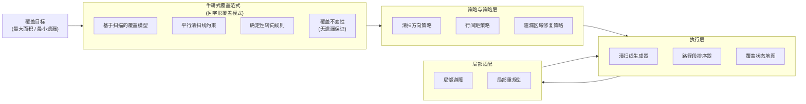

## 一、什么是牛耕式覆盖路径规划？

**牛耕式（Boustrophedon）**这个名字来自农民犁地的方式：

> 一行一行地走，走到头就掉头，像“之”字形一样覆盖整个区域。

在**室内清洁机器人**中，它的目标是：

> **用最简单、最稳定的方式，把一个房间完整清扫一遍，尽量不重扫、不漏扫。**

---

## 二、为什么室内清洁机器人特别适合牛耕式？

### 1️⃣ 清扫本质 = 面覆盖

清洁机器人不是去“找目标”，而是：

* 地面 **每一块都要走到**
* 清扫效率 > 路径最短

牛耕式的天然优势就是：

* 面覆盖率高
* 路径规则、可预测

---

### 2️⃣ 室内环境特点非常契合

| 室内环境特点    | 牛耕式的适配点   |
|-----------|-----------|
| 房间大多是封闭区域 | 可以分区后逐区覆盖 |
| 障碍物多但位置固定 | 可做区域切分    |
| 地面近似二维平面  | 行扫描非常高效   |
| 清扫宽度固定    | 非常适合等距平行线 |

---

## 三、牛耕式在清洁机器人中的整体流程（工程视角）

### 🔷 Step 1：建图（Map）

通常使用：

* 激光 SLAM（2D Occupancy Grid）
* 或 VSLAM + 投影到平面

结果是：

* 一个 **二维栅格地图**
* 每个格子：空闲 / 障碍 / 未知

---

### 🔷 Step 2：可清扫区域提取

从地图中提取：

* 可通行区域（free space）
* 剔除：

    * 墙
    * 家具
    * 禁区

👉 得到一个或多个 **连通区域**

---

### 🔷 Step 3：区域分解（关键步骤）

这是牛耕式真正厉害的地方。

#### Boustrophedon Cellular Decomposition（BCD）

核心思想：

> **把复杂区域，分解成若干“没有内凹”的子区域**

每个子区域：

* 可以用简单的平行线一次扫完
* 避免反复绕障碍

📌 对清洁机器人来说：

* 一个房间 ≠ 一个区域
* 桌子、沙发会把房间分成多个 cell

---

### 🔷 Step 4：牛耕式路径生成

在每个 cell 内：

* 选定一个方向（横扫 or 竖扫）
* 按清扫宽度生成等距平行线
* 路径呈现：

```
>>>>>>>>>>>
<<<<<<<<<<<
>>>>>>>>>>>
<<<<<<<<<<<
```

特征：

* 相邻两条线间距 ≈ 清扫宽度
* 末端直接掉头

---

### 🔷 Step 5：Cell 间连接

清洁机器人不会只扫一个 cell：

* 按某种顺序访问所有 cell
* 常见策略：

    * 邻近优先
    * 最短过渡路径
    * DFS / BFS 顺序

---

## 四、牛耕式在实际清洁机器人中的优缺点

### ✅ 优点（这就是它被大量商用采用的原因）

| 优点        | 对清洁机器人的意义              |
|-----------|------------------------|
| 实现简单      | 算法稳定，调试成本低             |
| 覆盖率高      | 不容易漏扫                  |
| 路径规则      | 易做“已扫/未扫”标记            |
| 可解释性强     | 用户看得懂（直线来回）            |
| 与栅格地图天然匹配 | 直接在 occupancy grid 上操作 |

---

### ❌ 缺点（你在做产品一定会遇到）

| 问题         | 实际表现           |
|------------|----------------|
| 对动态障碍不友好   | 人走动、椅子挪动会破坏规划  |
| 转弯次数多      | 能耗、时间增加        |
| 对非矩形区域效率下降 | 奇怪房型会产生碎片 cell |
| 容易在狭窄区域抖动  | 走廊、桌脚附近        |

---

## 五、商用清洁机器人是如何“改造”牛耕式的？

现实中几乎**没有纯牛耕式**，而是工程化增强版本。

### 1️⃣ 智能分房 + 房间级牛耕

* 先做 **Room Segmentation**
* 每个房间独立牛耕
* 顺序由全局调度决定

---

### 2️⃣ 主方向自适应选择

不是固定横扫或竖扫：

* 计算房间主轴
* 选择 **长边方向** 扫
* 减少转弯次数

---

### 3️⃣ 边缘优先 + 内部牛耕

常见策略：

1. 先沿墙走一圈（Edge Following）
2. 再内部牛耕式覆盖

👉 提升贴边清扫效果

---

### 4️⃣ 覆盖 + 局部重规划

当遇到：

* 新障碍
* 未扫区域暴露

就：

* 局部重新生成牛耕线
* 不重算全图

## 一、牛耕覆盖软件总体架构（分层清晰）

