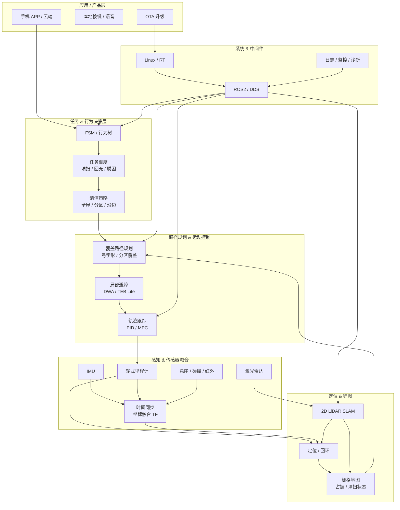

## 一、整体软件架构

**室内清洁机器人 ≈ 缩小版自动驾驶系统 + 清洁业务逻辑**

可以抽象成 6 大软件层：

```
┌──────────────────────────┐
│        应用 / 产品层      │ ← 清洁策略 / APP / 云
├──────────────────────────┤
│      任务 & 行为决策层     │ ← FSM / BT
├──────────────────────────┤
│    路径规划 & 运动控制     │ ← 覆盖规划是核心
├──────────────────────────┤
│        定位 & 建图         │ ← SLAM 是地基
├──────────────────────────┤
│     感知 & 传感器融合      │ ← 室内环境理解
├──────────────────────────┤
│    系统 & 中间件层         │ ← ROS / Linux
└──────────────────────────┘
```

## 二、系统 & 中间件层（地基）

### 1️⃣ 操作系统 & 中间件

> 扫地机器人是 **强实时 + 多传感器 + 多线程**
> 没有一个稳定的通信与调度模型，后面全崩

* Linux（Ubuntu / Yocto）
* [ROS1 / ROS2（强烈建议 ROS2）](操作系统中间件/ROS%20升级指南.md)
* [DDS 通信模型（实时性 & 稳定性）](操作系统中间件/DDS%20通信模型.md)

**必须关注的系统指标：**

* 节点崩溃是否能自恢复
* CPU / 内存 / 实时调度
* 日志系统（量产必备）

* 哪些节点是 hard / soft realtime
* 控制链路是否走 RT Thread / PREEMPT_RT
* DDS QoS 如何配置（reliable / best effort）

---

## 三、感知层

### 2️⃣ 传感器体系（软件视角）

常见配置：

* 激光雷达（2D 为主）
* IMU
* 编码器
* 碰撞传感器
* 悬崖传感器
* （高端）RGB / RGB-D 摄像头

**软件关注点**

* [时间同步（时间戳）](时间同步工程清单.md)
* [坐标系统一（TF）](坐标系统一工程清单.md)
* [传感器异常检测（雷达遮挡、轮滑）](传感器异常检测工程清单.md)

---

### 3️⃣ 感知处理

扫地机器人不需要 YOLO 那么重，但需要：

* 障碍物提取（雷达点云 → 障碍）
* 动态障碍判断（人 / 宠物）
* 地面状态判断（地毯 / 地板）

---

## 四、定位 & 建图（SLAM 是核心中的核心）

### 4️⃣ SLAM 模块

常见方案：

* [GMapping](定位建图/GMapping.md) / [Cartographer](定位建图/Cartographer.md) / [SLAM Toolbox](定位建图/SLAM%20Toolbox.md)
* 自研 2D 激光 SLAM
* [VSLAM](定位建图/VSLAM.md)（中高端）

**必须解决的问题：**

* 长时间运行不漂
* 回环检测
* 断电重启地图恢复
* 地图持久化（Flash / eMMC）

**室内清洁特有痛点：**

* 布局会动
* 激光容易被窗帘、桌布干扰


* Occupancy Map（定位）
* Coverage Map / Cleaned Map（业务）

---

## 五、路径规划 & 运动控制（[Navigation2](规划控制/Nav2.md)）

- [全局规划](规划控制/全局规划.md)
- [局部规划](规划控制/局部规划.md)

### 5️⃣ [路径规划]

#### （1）覆盖路径规划（Coverage Planning）

目标不是 A→B，而是：

> **100% 覆盖 + 尽量不重复 + 不漏扫**

常见算法：

* 弓字形 / [牛耕式 Boustrophedon](规划控制/牛耕田.md)
* [分区覆盖](规划控制/分区覆盖.md)（房间级）
* 栅格地图覆盖

#### （2）局部避障

* [DWA](规划控制/局部避障/DWA.md) / [TEB](规划控制/局部避障/TEB.md)（轻量版）
* 人突然走过
* 椅子被挪走

📌 **清洁机器人最难的不是避障，而是：**

> 避障后如何 **“无缝回到原清扫轨迹”**

---

### 6️⃣ 运动控制

* 差速 / 全向底盘
* 轨迹跟踪（PID / [MPC](MPC.md) 简化版）
* 防打滑 / 防卡死

**必须做：**

* 电机异常检测
* 被困检测（转不动但有码）

---

## 六、任务 & 行为决策层

### 7️⃣ 行为决策

典型实现：

* FSM（有限状态机）
* 行为树（BT）

常见状态：

* 待机
* 建图
* 清扫
* 回充
* 脱困
* 错误处理


* 低电量 > 清扫
* 传感器异常 > 当前任务
* 被困 > 路径规划

---

## 七、应用 / 产品层

### 8️⃣ 清洁业务逻辑

这是和“科研机器人”最大的区别：

* 清扫模式（全屋 / 定点 / 沿边）
* 吸力策略
* 地毯识别自动加力
* 禁区 / 虚拟墙

---

### 9️⃣ 人机交互 & 云

* APP 通信协议
* OTA 升级
* 地图编辑
* 日志回传

---

## 八、软件工程层面的“隐藏大坑”（很多人忽略）

### 10️⃣ 工程化必须考虑的点

✔ 模块解耦
✔ 异常兜底（几乎所有传感器都可能挂）
✔ 数据回放（rosbag）
✔ 参数在线调节
✔ 日志 + 崩溃自动恢复

> 很多扫地机器人 **不是算法不行，是工程不稳**

## 🧠 室内清洁机器人软件架构图（Mermaid）


