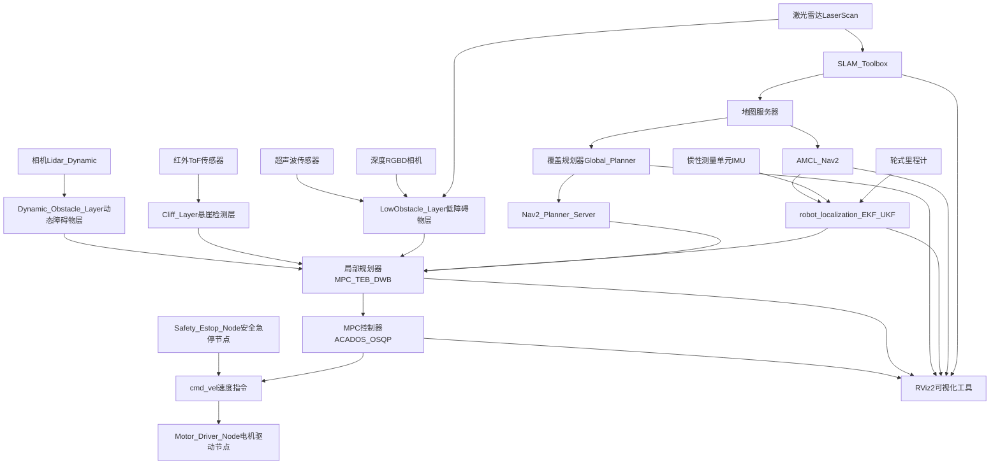

## ROS2 清洁机器人原型机模块数据流

```
Sensors
├─ Lidar → LaserScan → SLAM Toolbox / AMCL → map / pose
├─ Wheel Odom → EKF / robot_localization → fused odom → MPC / Local Planner
├─ IMU → EKF / robot_localization → fused odom → MPC / Local Planner
├─ Depth Camera / RGB-D → LowObstacle Layer → Local Costmap
├─ IR / ToF → Cliff Layer → Local Costmap
├─ Ultrasonic → LowObstacle Layer → Local Costmap
├─ Camera / LiDAR → Dynamic Obstacle Detection → Dynamic Layer → Local Costmap

SLAM Stage
├─ SLAM Toolbox → produces /map and /tf (for first-time mapping)
├─ MapServer → serves static /map (for repeated cleaning)
├─ AMCL → produces high-frequency pose /tf in known map

Localization Fusion
├─ robot_localization (EKF / UKF)
    └─ Inputs: wheel odom, IMU, AMCL pose
    └─ Output: /odom_combined → MPC / Local Planner / Nav2 Controller

Planning
├─ Coverage Planner (Global Planner Plugin)
    └─ Inputs: /map + known cleaning area
    └─ Output: global path → Local Planner (MPC / TEB / DWB)
├─ Nav2 Planner Server → invokes global planner plugin if needed

Local Control
├─ Local Planner Plugin (MPC / TEB / DWB)
    ├─ Inputs: global path + local costmap + /odom_combined
    ├─ Obstacle layers: LowObstacle, Cliff, Dynamic
    ├─ Outputs: /cmd_vel → motor controllers
├─ MPC Controller (ACADOS / OSQP)
    └─ Smooth path tracking, speed/acceleration constraints

Visualization & Debug
├─ RViz2 → visualize /map, /odom_combined, global path, local path, predicted MPC trajectory
├─ Logging → ROS2 logging / Glog

Hardware Interface
├─ Motor Driver Node → subscribes /cmd_vel
├─ Safety E-stop Node → can override /cmd_vel
```

---

### 🔹 模块说明

| 模块                               | 功能                | 输入                                         | 输出             |
|----------------------------------|-------------------|--------------------------------------------|----------------|
| **SLAM Toolbox**                 | 在线/离线建图           | Lidar, Odom                                | /map, /tf      |
| **AMCL**                         | 静态地图定位            | /map, /scan, odom                          | /tf            |
| **robot_localization (EKF/UKF)** | 多传感器融合，高频位姿       | wheel odom, IMU, AMCL pose                 | /odom_combined |
| **Coverage Planner**             | 全局覆盖路径规划          | /map, cleaning area                        | global path    |
| **Nav2 Planner Server**          | 调度 global planner | map, goal                                  | path           |
| **Local Planner Plugin**         | MPC / TEB / DWA   | global path, local costmap, /odom_combined | /cmd_vel       |
| **Costmap Layers**               | 障碍物扩展             | Sensors                                    | local costmap  |
| LowObstacle Layer                | 低矮障碍检测            | Depth Camera / Ultrasonic                  | local costmap  |
| Cliff Layer                      | 悬崖 / 楼梯检测         | IR / ToF                                   | local costmap  |
| Dynamic Obstacle Layer           | 动态障碍预测            | Lidar / Camera                             | local costmap  |
| **MPC Controller**               | 平滑路径跟踪            | global path, local costmap, fused odom     | /cmd_vel       |
| **Motor Driver**                 | 控制底盘              | /cmd_vel                                   | 电机控制信号         |
| **RViz2**                        | 可视化               | /map, /odom, /path, /mpc_trajectory        | UI             |

---

### 🔹 数据流说明

1. 传感器采集 → 各层 Costmap / SLAM / EKF
2. SLAM Toolbox 构建地图 → MapServer 提供给 Nav2
3. AMCL 定位 + EKF 融合 → 高频位姿 → MPC / Local Planner
4. Coverage Planner 生成全局覆盖路径 → Local Planner / MPC 跟踪
5. Costmap 各层（低矮障碍、悬崖、动态障碍）更新局部地图 → Local Planner 避障
6. Local Planner / MPC 输出 /cmd_vel → Motor Driver → 机器人执行
7. RViz2 可视化全链路：地图、路径、局部轨迹、预测轨迹



---

### 🔹 说明

1. **传感器层**：Lidar、Camera、IMU、Wheel Odom、Depth / IR / Ultrasonic
   → 输出给 Costmap Layer / SLAM / EKF
2. **SLAM阶段**：SLAM Toolbox 构建地图 → MapServer 提供给 Coverage Planner + AMCL
3. **定位融合**：AMCL + WheelOdom + IMU → EKF 输出高频位姿
4. **全局规划**：Coverage Planner → Nav2 Planner Server → Local Planner
5. **局部控制**：Local Planner + MPC Controller → /cmd_vel → MotorDriver
6. **Costmap层**：LowObstacle / Cliff / Dynamic → Local Planner 避障
7. **可视化**：RViz2 可同时订阅地图、路径、轨迹和机器人位姿

